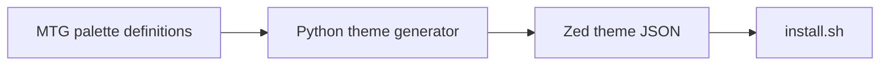

# MTG Zed Themes

Magic: The Gathering color identity and guild themes for [Zed](https://zed.dev).


## ANZSCO 261211 + 261312 Skills Snapshot
- Visual identity theme design and color-system packaging for editor customization (261211).
- Scripted artifact generation and maintenance for editor theme assets (261312).
- Workflow automation for repeatable build/install operations (261312).

## Themes (25)

- **Mono colors:** Plains White, Island Blue, Swamp Black, Mountain Red, Forest Green
- **Ravnica guilds:** Azorius, Dimir, Rakdos, Gruul, Selesnya, Orzhov, Izzet, Golgari, Boros, Simic
- **Alara shards:** Bant, Esper, Grixis, Jund, Naya
- **Extra:** Temur, Jeskai, Sultai, Mardu, Chrome Mox

## Install

```bash
git clone https://github.com/jen-the-dev/zed-mtg-themes.git
cd zed-mtg-themes
python3 scripts/generate_mtg_themes.py   # only needed if themes/ is missing
./install.sh
```

Restart Zed, then choose **Theme: Select Theme**.

## Cursor

Ported automatically in [cursor-themes](https://github.com/jen-the-dev/cursor-themes) as `Mtg - ...` themes.

## Regenerate

Edit palettes in `scripts/generate_mtg_themes.py`, then:

```bash
python3 scripts/generate_mtg_themes.py
```

## License

MIT


## Problem
Maintaining a large themed editor palette requires automation to keep generated files consistent.

## Solution
A generated Zed theme set based on Magic color identities with script-driven regeneration and installation workflow.

## Architecture Diagram


## Tech Stack
- Python
- Shell scripts
- JSON theme definitions

## Setup Instructions
```bash
git clone https://github.com/jen-the-dev/zed-mtg-themes.git
cd zed-mtg-themes
python3 scripts/generate_mtg_themes.py
./install.sh
```

## Testing
- python3 scripts/generate_mtg_themes.py
- Manual theme validation in Zed

## ANZSCO 261211 + 261312 Competency Evidence
- **261211 (Multimedia Specialist)**: visual theming design mapped to coherent style systems.
- **261312 (Developer Programmer)**: scripted content generation and repeatable automation pipeline.
- Presentation-quality tooling documentation for adoption and maintenance.

## Commit Convention
Use Conventional Commits for presentation clarity:
- `feat(scope): add new user-facing capability`
- `fix(scope): resolve functional defect`
- `test(scope): add or improve automated tests`
- `docs(readme): improve project documentation`

## Evidence Map
- `scripts/generate_mtg_themes.py`
- `themes/`
- `install.sh`
